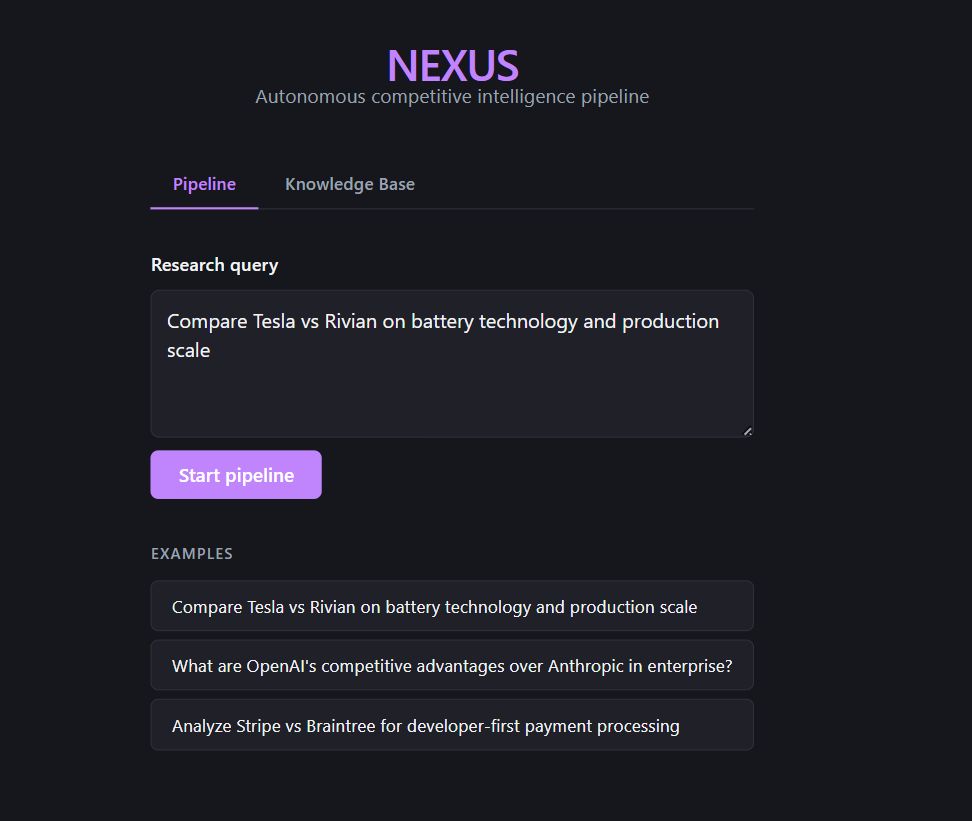
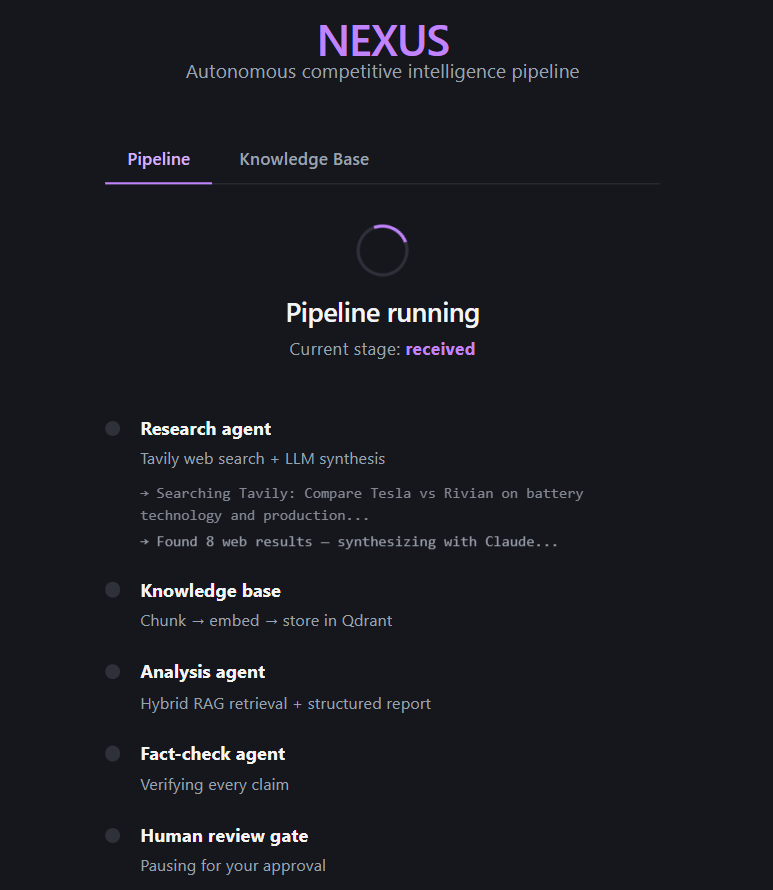
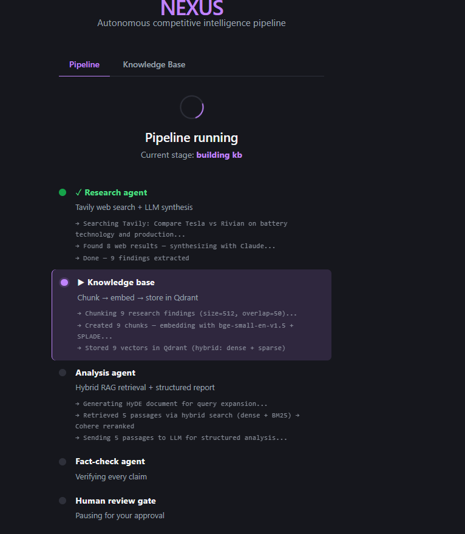
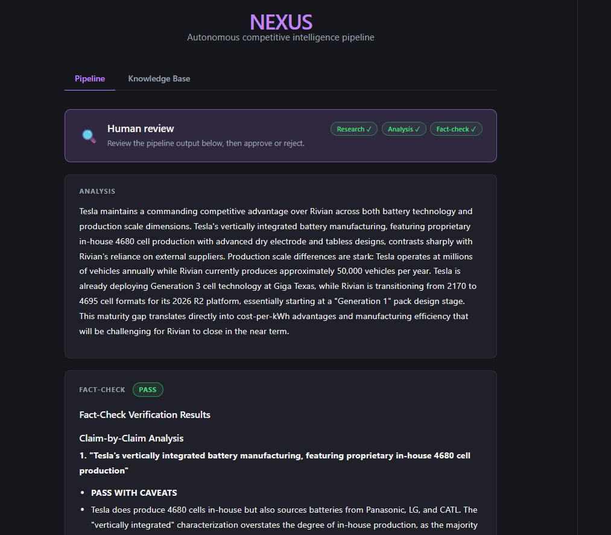
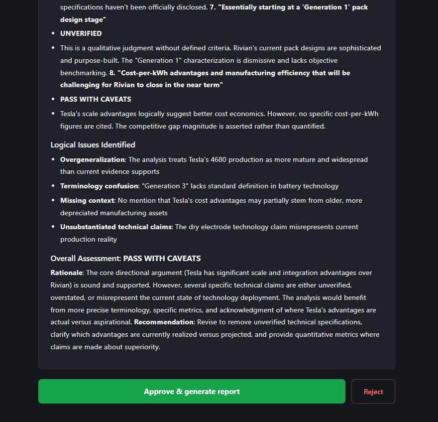
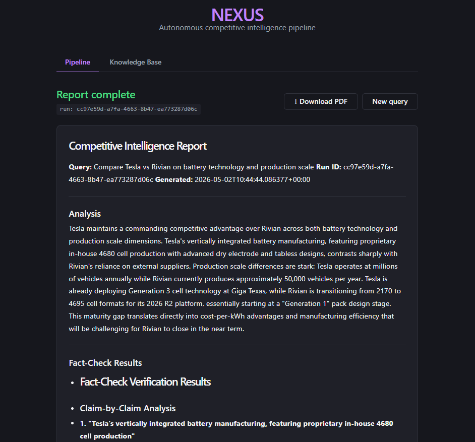
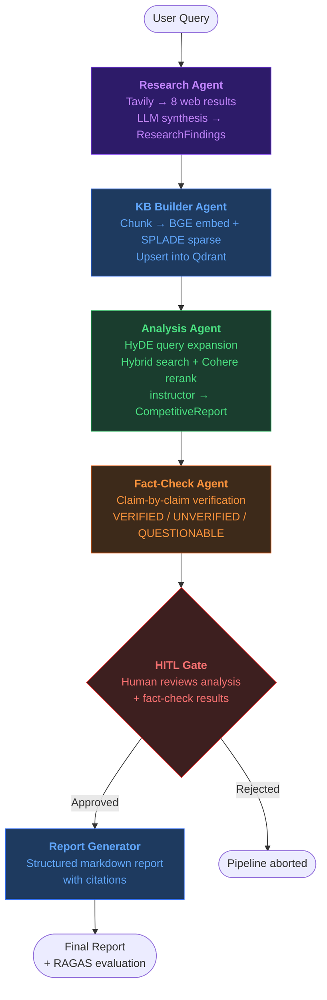

<div align="center">

# ⬡ NEXUS

### Autonomous Multi-Agent Competitive Intelligence System

*Query anything. Research the web. Build a knowledge base. Analyze. Fact-check. Human approval. Ship a report.*

[](https://python.org)
[](https://fastapi.tiangolo.com)
[](https://langchain-ai.github.io/langgraph/)
[](https://react.dev)
[](https://typescriptlang.org)
[](https://docker.com)
[](https://qdrant.tech)
[](LICENSE)

<br/>

> **NEXUS** turns a plain-English question into a structured competitive intelligence report — fully automated, with a human approval gate before the final output ships.

<br/>









</div>

---

## What makes this different

Most AI tools are wrappers. NEXUS is an end-to-end **agentic pipeline** with real engineering depth:

| Capability | What NEXUS does |
|---|---|
| **Real web search** | Tavily API → 8 live results with citations, not hallucinations |
| **Hybrid RAG** | Dense (BGE) + sparse (SPLADE/BM25) retrieval, Cohere reranking |
| **Query expansion** | HyDE — generates a hypothetical answer to improve retrieval recall |
| **Structured output** | `instructor` + Pydantic v2 — LLM output is always schema-valid |
| **Guardrails** | Guardrails AI validates the analysis before it advances |
| **Human-in-the-loop** | LangGraph interrupt — pipeline pauses for your approval |
| **Observability** | Every LLM call traced in Langfuse with latency + token cost |
| **Evaluation** | RAGAS scores faithfulness, answer relevancy, context precision |
| **Live streaming** | SSE streams per-agent progress to the browser in real time |
| **Async execution** | Celery workers — pipeline runs in the background, never blocks |

---

## Pipeline Architecture



Each agent runs as a **LangGraph node** orchestrated by a supervisor. State is persisted in Redis — if the pipeline crashes, it resumes exactly where it left off.

---

## Tech Stack

### Backend
| Layer | Technology | Why |
|---|---|---|
| Orchestration | [LangGraph](https://langchain-ai.github.io/langgraph/) | Stateful multi-agent graphs with interrupt/resume |
| LLM Gateway | [OpenRouter](https://openrouter.ai) | Single API key for Claude, GPT-4, Mistral, etc. |
| Web Search | [Tavily](https://tavily.com) | Real-time web results with clean content extraction |
| Vector DB | [Qdrant](https://qdrant.tech) | Hybrid dense + sparse search in one collection |
| Dense Embeddings | `BAAI/bge-small-en-v1.5` | Fast, high-quality 384-dim sentence embeddings |
| Sparse Embeddings | `prithivida/Splade_PP_en_v1` | BM25-style term weighting via SPLADE |
| Reranking | [Cohere Rerank](https://cohere.com) | Cross-encoder reranking on retrieved passages |
| Structured Output | [instructor](https://python.useinstructor.com) + Pydantic v2 | Guaranteed schema-valid LLM responses |
| Guardrails | [Guardrails AI](https://guardrailsai.com) | Runtime validation before pipeline advances |
| Observability | [Langfuse](https://langfuse.com) | LLM traces, latency, token cost per agent |
| Evaluation | [RAGAS](https://docs.ragas.io) | Faithfulness, answer relevancy, context precision |
| Task Queue | Celery + Redis | Async pipeline execution, HITL state sharing |
| API | FastAPI + uvicorn | Async Python, SSE streaming, automatic OpenAPI docs |
| State | `langgraph-checkpoint-redis` | Cross-process checkpoint for Celery ↔ FastAPI |

### Frontend
| Layer | Technology |
|---|---|
| Framework | React 19 + TypeScript |
| Build | Vite |
| Streaming | Browser `EventSource` (SSE) |
| Markdown | `react-markdown` + `remark-gfm` |
| Styling | Pure CSS with CSS variables (dark + light mode) |

### Infrastructure
| Component | Technology |
|---|---|
| Containerization | Docker Compose (5 services) |
| Reverse proxy + HTTPS | Caddy (auto SSL via Let's Encrypt) |
| Vector storage | Qdrant persistent volume |
| State + broker | redis-stack (RediSearch module required) |

---

## Quick Start

### Prerequisites
- [Docker Desktop](https://docs.docker.com/get-docker/) (includes Docker Compose)
- [Node.js 20+](https://nodejs.org) (for frontend dev only)
- API keys: [OpenRouter](https://openrouter.ai/keys), [Tavily](https://tavily.com) (optional but recommended)

### 1. Clone and configure

```bash
git clone https://github.com/YOUR_USERNAME/nexusAI.git
cd nexusAI
cp .env.example .env
```

Edit `.env` — at minimum, set:
```env
OPENROUTER_API_KEY=sk-or-v1-...      # Required
TAVILY_API_KEY=tvly-...              # Optional — enables real web search
COHERE_API_KEY=...                   # Optional — enables reranking
```

### 2. Start all services

```bash
docker compose up -d
```

This starts 4 containers:
| Container | Role | Port |
|---|---|---|
| `nexus-api` | FastAPI + uvicorn | `8000` |
| `celery-worker` | Background pipeline execution | — |
| `qdrant` | Vector database | `6333` |
| `redis` | State + Celery broker | `6379` |

### 3. Build and open the frontend

```bash
cd frontend
npm install
npm run dev        # Dev server at http://localhost:5173
```

Or build for production:
```bash
npm run build      # Outputs to frontend/dist/
```

### 4. Run your first query

Open `http://localhost:5173` and submit a query like:

> *"What are OpenAI's competitive advantages over Anthropic in enterprise sales?"*

Watch the pipeline execute live — each agent streams its progress to the browser as it runs.

---

## Environment Variables

| Variable | Required | Description |
|---|---|---|
| `OPENROUTER_API_KEY` | ✅ Yes | LLM gateway — get at [openrouter.ai/keys](https://openrouter.ai/keys) |
| `OPENROUTER_MODEL` | No | Default: `anthropic/claude-sonnet-4.6` |
| `TAVILY_API_KEY` | Recommended | Real web search. Without it, falls back to LLM-only research |
| `COHERE_API_KEY` | Recommended | Enables Cohere cross-encoder reranking on retrieved passages |
| `QDRANT_URL` | No | Default: `http://localhost:6333` (or `http://qdrant:6333` in Docker) |
| `REDIS_URL` | No | Default: `redis://localhost:6379/0` (or `redis://redis:6379/0` in Docker) |
| `LANGFUSE_SECRET_KEY` | No | LLM observability. Get at [cloud.langfuse.com](https://cloud.langfuse.com) |
| `LANGFUSE_PUBLIC_KEY` | No | Pair with secret key above |
| `CHUNK_SIZE` | No | Default: `512` tokens per chunk |
| `RERANK_TOP_K` | No | Default: `5` passages sent to analysis LLM |
| `APP_ENV` | No | `development` or `production` |

---

## Project Structure

```
nexusAI/
├── nexus/
│   ├── agents/
│   │   ├── supervisor.py          # LangGraph graph definition + HITL interrupt
│   │   ├── research_agent.py      # Tavily search + LLM synthesis
│   │   ├── kb_builder_agent.py    # Chunk → embed → Qdrant ingest
│   │   ├── analysis_agent.py      # HyDE + hybrid RAG + structured report
│   │   └── factcheck_agent.py     # Claim verification
│   ├── rag/
│   │   ├── chunker.py             # Recursive text chunking
│   │   ├── embedder.py            # BGE dense + SPLADE sparse embeddings
│   │   ├── retriever.py           # Hybrid search + Cohere rerank
│   │   └── hyde.py                # Hypothetical Document Embeddings
│   ├── api/
│   │   ├── main.py                # FastAPI app + CORS + lifespan
│   │   └── routers/
│   │       ├── reports.py         # Pipeline run, approve, SSE stream, eval
│   │       ├── kb.py              # Manual KB ingest + stats
│   │       └── research.py        # Standalone research endpoint
│   ├── schemas/
│   │   ├── state.py               # NexusState TypedDict + PipelineStage enum
│   │   ├── report.py              # CompetitiveReport Pydantic model
│   │   └── config.py              # Settings (pydantic-settings, .env)
│   ├── evaluation/
│   │   ├── ragas_eval.py          # RAGAS faithfulness + relevancy scoring
│   │   └── golden_dataset.py      # Curated evaluation dataset
│   ├── workers/
│   │   └── tasks.py               # Celery tasks (run + resume pipeline)
│   └── utils/
│       └── progress.py            # Redis-backed live progress messages
├── frontend/
│   └── src/
│       ├── components/
│       │   ├── PipelineProgress.tsx  # SSE-driven live stage tracker
│       │   ├── HITLReview.tsx        # Human review + approve/reject
│       │   ├── ReportView.tsx        # Report + RAGAS scores + PDF export
│       │   └── KbView.tsx            # Manual KB management
│       └── api/
│           ├── client.ts             # Fetch + SSE wrappers
│           └── types.ts              # Shared TypeScript interfaces
├── docker-compose.yml             # Development (4 services)
├── docker-compose.prod.yml        # Production overrides (adds Caddy)
├── Caddyfile                      # Reverse proxy + auto HTTPS config
├── Dockerfile                     # Python 3.11 slim image
├── deploy.sh                      # One-command production deploy
└── pyproject.toml                 # Dependencies + project metadata
```

---

## API Reference

The FastAPI server exposes a self-documenting API at `http://localhost:8000/docs`.

### Key Endpoints

```
POST /v1/reports/run/async          Start a pipeline run (returns run_id immediately)
POST /v1/reports/approve/async      Resume after HITL approval/rejection
GET  /v1/reports/status/{run_id}    Poll current pipeline state
GET  /v1/reports/stream/{run_id}    SSE stream — real-time stage + progress updates
POST /v1/reports/status/{id}/evaluate  Run RAGAS evaluation on a completed run

POST /v1/kb/ingest                  Manually ingest documents into Qdrant
GET  /v1/kb/stats                   Collection stats (vectors, status)

GET  /health                        Liveness probe
```

### SSE Event Shape

Every event emitted on the stream:
```json
{
  "run_id": "uuid",
  "stage": "analyzing",
  "is_waiting_for_approval": false,
  "analysis_summary": "...",
  "errors": [],
  "logs": [
    { "msg": "Retrieved 8 passages via hybrid search", "stage": "analyzing", "ts": 1234567890.0 }
  ]
}
```

---

## Evaluation

NEXUS includes a built-in quality evaluation layer powered by **RAGAS**.

```bash
# Evaluate a completed run
curl -X POST http://localhost:8000/v1/reports/status/{run_id}/evaluate
```

```json
{
  "run_id": "...",
  "scores": {
    "faithfulness": 0.91,
    "answer_relevancy": 0.87,
    "context_precision": 0.83
  }
}
```

| Metric | What it measures |
|---|---|
| **Faithfulness** | Are all claims in the report grounded in the retrieved passages? |
| **Answer Relevancy** | Does the report actually answer the original query? |
| **Context Precision** | Was the retrieved context relevant, or was there noise? |

A golden dataset of curated queries and expected answers is in [`nexus/evaluation/golden_dataset.py`](nexus/evaluation/golden_dataset.py) for regression testing.

---

## Production Deployment

### Deploy to any Linux VPS in 5 minutes

```bash
# On your server (Ubuntu 22.04)
curl -fsSL https://get.docker.com | sh
git clone https://github.com/YOUR_USERNAME/nexusAI.git && cd nexusAI
cp .env.example .env && nano .env   # Fill in your API keys
bash deploy.sh
```

`deploy.sh` builds the frontend, rebuilds Docker images, and restarts all services. Run it again any time you push new code.

For HTTPS, edit `Caddyfile` and replace `:80` with your domain — Caddy obtains a Let's Encrypt certificate automatically.

---

## How the HITL Gate Works

The human-in-the-loop gate is one of the most technically interesting parts of NEXUS.

1. After fact-checking, LangGraph raises an **interrupt** — the graph halts mid-execution and persists its full state to Redis via `AsyncRedisSaver`.
2. The FastAPI response returns `is_waiting_for_approval: true` and the browser shows the review screen.
3. The human reads the analysis summary and fact-check results, then clicks **Approve** or **Reject**.
4. The approval is dispatched to a Celery worker via `resume_pipeline_task`, which resumes the graph by calling `ainvoke(None, config=thread_config)` — LangGraph continues from exactly where it stopped.
5. The SSE connection stays open throughout, detecting completion after resume.

This works across process boundaries (FastAPI → Celery → FastAPI) because both use `AsyncRedisSaver` pointing at the same Redis instance.

---

## Contributing

1. Fork the repo and create a feature branch
2. Follow the coding rules in [`CLAUDE.md`](CLAUDE.md) — Pydantic v2, structlog, no print(), async everywhere
3. Add a test in `tests/unit/` or `tests/integration/` for any non-trivial change
4. Open a PR with a clear description of what changed and why

---

## License

MIT — see [LICENSE](LICENSE)

---

<div align="center">

Built with LangGraph · Qdrant · FastAPI · React · Celery · Redis

*If this helped you, star the repo ⭐*

</div>
